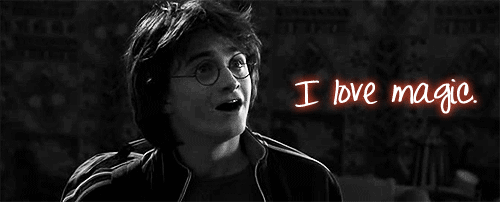
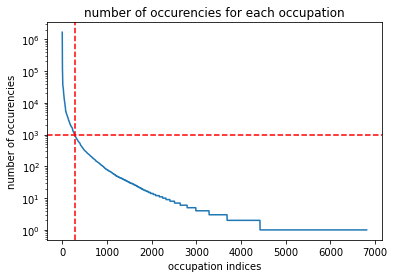
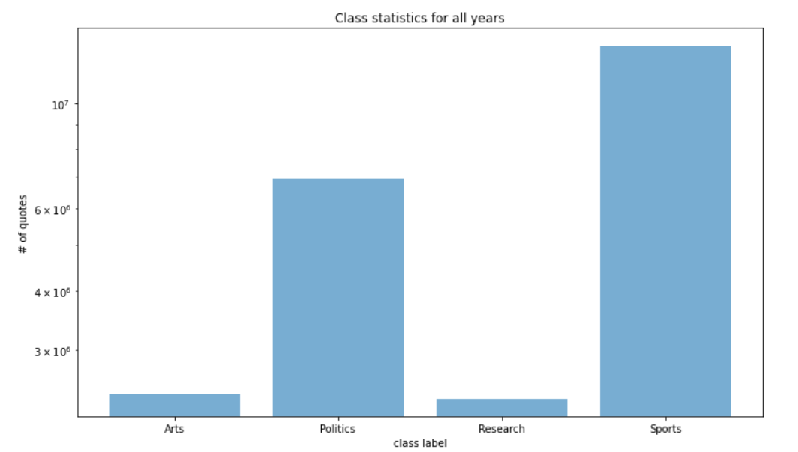
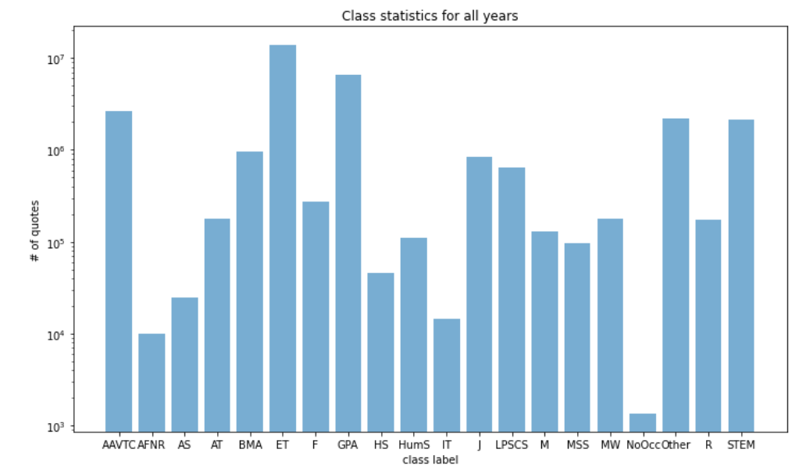
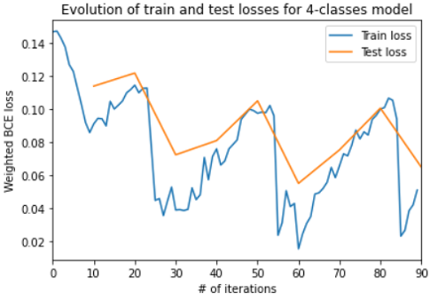
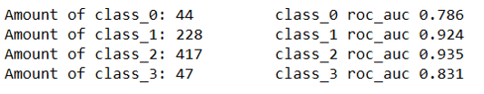

Ever heard of [Catch Me If You Can](https://en.wikipedia.org/wiki/Catch_Me_If_You_Can) ? In this movie, the main character impersonates many professions mainly by appropriating their uniforms, specific behaviours and lingos, and everybody fall for it !  

<figure>
    

    
    

</figure>

For the uniform it is quite obvious, but what can we say about the lingo ? One will agree that each occupation has its « proper words », but let's think further, a person of a specific profession will also express himself in a certain manner. Think of a politician, he does not only speaks about economy and education, but also uses some figure of speech, and his discourse is fluid and well conducted; rather of a sportsman or a scientist, for exemple.  

Based on this statement: give us a quote, and we will tell you which profession said it ! 

## Table of Contents

- [Datasets](#datasets)
- [Filtering](#filtering)
- [Occupation clustering](#occupation-clustering)
- [BERT](#bert)
- [First results](#first-results)
- [Can we do better ?](#can-we-do-better-?)
- [Results and limitations](#results-and-limitations)
- [Room for improvement](#room-for-improvement)
- [References](#references)

## Datasets   
  
#### Quotebank
We do we have here ? The full dataset is made of 178 million quotations together with a list of possible speaker ranked by probability, the name of the most probable speaker and its [Wikidata](https://www.wikidata.org/wiki/Wikidata:Main_Page) Qid, when it has been published, and where it has been published. The later is important because this information has been exctracted out of 162 million English news articles published between 2008 and 2020 included, so one might want to keep records of it.

162 million, 178 million, but who did that ? Well it's the nice library assistant Quobert, and it does it freely. Here is a nice picture (taken from [this publication](https://dlab.epfl.ch/people/west/pub/Vaucher-Spitz-Catasta-West_WSDM-21.pdf)[^1] explaining in full detail how the dataset has been collected) that could help you to grasp Quobert's workflow.

<figure>
    

    
    

</figure>

Super nice, except that it correctly attributes only about 85% of the quotations. But could you except better from un unpaid assistant ?  
Here is some of its failures:

<figure>
    

    
    

</figure>

* The Harry Potter he refers to is an [Australian journalist](https://en.wikipedia.org/wiki/Harry_Potter_(journalist)).
* Joe Bidden does not like himself so much.

But this will be good enough for our purpose. Just keep in mind that Quobert is an unpaid assistant.  
Furthermore, for this project, we did not use the full Quotebank but only the years 2015-2020 included.

#### External sources
We said we want to predict the occupations but did not said a word about it so far... Quotebank is augmented using metadata about the speakers. It an external dataset we will find for ~9M Wikidata entities some additional information as occupation, gender, religion, etc.

## Filtering

In the first place, we had to deal with the "homonym issue". This is because a quotation is linked to a list of names, ranked by probability, and further linked to a single name in a "winner takes it all" fashion. Once a name is elected, the name is linked to its corresponding Qid; BUT if a name has a namesake, then several Qids will be added. So how do we know that we are facing Harry Potter the magician or Harry Potter the journalist (it does not really apply in this case because there is no fictional character in Quotebank, but you got the point) ? Furthermore, if Quobert is uncertain, it just assigns "None" as speaker with an empty list of Qid.To cope with those issues we simply filtered out all speakers, whose list of Qid contained more or less than 1 Qid.  
By doing so we dealt with both the "homonym issue" and the "empty speaker issue" and get rid of 50% of the remaining data.

<figure>
    

    
    

</figure>

Fine, but now suppose that Harry Potter the magician was tired of figthing evil, and after all, You-Know-Who has been defeated in 2011 so... He decided to start a career as a journalist at the renown "The Daily Prophet" newspaper. We now have Harry Potter the magician and Harry Potter the journalist (it is the same person now). So how do we know that his quotes are those of a magician or those of a journalist ?  
This is why we remove all speaker that have more than one occupation. By doing so we remove 12% of the remaining data.

## Occupation clustering
By applying our filtering criterions on the external dataset, we find that there is 6800 different occupations in it. This is a lot. Here is a look at the distribution of occurencies of occupations:

<figure>
    

    
    

</figure>

We selectected an amount we can sort by hand = 280 (even though it is still a piece of work), this correspond to a treshold of occurencies > 1000. The downside is that we loose a lot of occupation just because we can't sort them by hand. We would need another unpaid assistant to do it for us... and we will come back later to that.

To define some clusters we looked at those publications [here](https://repository.library.georgetown.edu/handle/10822/559298)[^2] and [there](https://www.leyden212.org/Page/4244) about Career Clusters. Based on that we build two tables:  

This one is for the proof-of-concept of the -later explained- BERT-based classifier:

| Cluster | Label | Meaning | # of available quote|
|-------|--------|---------|---------|
| 0 | Research | Research and science related careers | 2'372'142 |
| 1 | Politics | Government related careers | 6'928'256 |
| 2 | Sports | Sport related careers | 13'237'461 |
| 3 | Arts | Artists and creator related careers | 2'421'718 |

<figure>
    

    
    

</figure>

This one is the one we want to achieve at the end

| Cluster | Label | Meaning | # of available quote|
|-------|--------|---------|---------|
| 0 | Other| NaN careers | 2'167'753|
| 1 | AFNR | Agriculture, Food and Natural Resources careers | 9'891 |
| 3 | AAVTC | Arts, Audio/Video Technology and Communications careers | 2'649'277 |
| 4 | BMA | Business Management and Administration careers | 961'273 |
| 5 | ET | Education and Training careers | 14'009'216 |
| 6 | F | Finance careers | 275'615 |
| 7 | GPA | Government and Public Administration careers | 6'491'038 |
| 8 | HS | Health Science careers | 46'010 |
| 9 | HumS | Human Services careers | 111,'82 |
| 10 | IT | Information Technology careers | 14'356 |
| 11 | LPSCS | Law, Public Safety, Corrections, and Security careers | 639'833 |
| 12 | M | Manufacturing careers | 129'037 |
| 13 | MSS | Marketing, Sales, and Service careers | 97'653 |
| 14 | STEM | Science, Technology, Engineering, and Mathematics careers | 2'152'432 |
| 15 | R | Religion related careers | 173'688 |
| 16 | AT | Academic and Teacher related careers | 177'524 |
| 17 | J | Journalism related careers | 839'391 |
| 18 | MW | Military and War related careers | 179'833 |
| 19 | AS | Aircraft and Space careers | 24'947 |
| 20 | NoOcc | Not clustered careers | 1365 |

<figure>
    

    
    

</figure>

If you noticed that the cluster #2 does not exist in the last table it is just because we created a cluster with no quotes in it by mistake... if yu didn't notice it, this is not so important.

## BERT
Where we find it
Did we modify it ?
Write about internal preprocessing

## First results
After having feed the classifier with the quotes clustered following the 4-classes table, and trained it for 20 minutes, we get the following results:

<figure>
    

    
    

</figure>

The behaviour of the curves has nothing to do with the swiss mountains; it just come from the fact that we used a scheduler to vary the lerning rate of our AdamW optimizer. But its internal clock was not well set so we find the strange behaviour. But it is fixed in the last use of the classifier.  
The important point is that it learns well and fast ! Here is the roc_auc for each class:

<figure>
    

    
    

</figure>

## Can we do better ?
blalala

## Results and limitations 
blalala

## Room for improvement
blalala

For this project, we used a large-scale dataset of Steam reviews compiled in 2021, which is openly available on Kaggle[^1].

#### Contents

#### Source caveats

#### Game tags

## Game embeddings

 train a Sent2vec[^2] 

[**this dedicated page**]()

## Classification with K-means clustering

<b>Click to view clusters</b> (games ordered alphabetically)

 
<ul>

<li><b>Cluster 1:</b> Banished, Factorio, Frostpunk, Kenshi, No Man's Sky, Oxygen Not Included, RimWorld, Satisfactory, Subnautica, Super Hexagon, Surviving Mars</li>

<li><b>Cluster 2:</b> Assassin's Creed Odyssey, Assassin's Creed Origins, Batman: Arkham Asylum GOTY Edition, BioShock Infinite, Dishonored, Dying Light, Rise of the Tomb Raider, Tomb Raider</li>

</ul>
 

The figure below shows the games which are part of each cluster. Use the menu to navigate to the cluster of your choice.
<iframe frameborder="no" border="0" marginwidth="0" marginheight="0" width="100%" height="500" src="/html/clusters.html"></iframe>
If you know your games well, you'll see that the clustering worked quite well, aside from a few oddities.

| Cluster | Size | Steam Genres | User-defined Tags | Prototype |
|-------|--------|---------|---------|---------|
| 1 | 11 | - | User Singleplayer | _Oxygen Not Included_ |
| 2 | 8 | Action | Action, Story Rich | _Rise of the Tomb Raider_ |
| 3 | 19 | - | Multiplayer, Singleplayer, Strategy | _Total War Saga: Thrones of Britannia_ |
| 4 | 8 | - | Adventure, Great Soundtrack, Singleplayer | _GRIS_ |
| 5 | 18 | Action | Action, Multiplayer | _SCUM_ |
| 6 | 11 | - | - | _Slay the Spire_ |
| 7 | 11 | - | Co-op, Multiplayer | _BattleBlock Theater_ |
| 8 | 16 | - | - | _Danganronpa: Trigger Happy Havoc_ |
| 9 | 10 | Action | Action, Co-op, Shooter, Singleplayer | _Tom Clancy's Ghost Recon® Wildlands_ |
| 10 | 6 | RPG | Adventure, Great Soundtrack, RPG, Singleplayer, Story Rich | _Tales of Berseria_ |
| 11 | 11 | Action | Action, Singleplayer | _Resident Evil 2_ |
| 12 | 10 | - | Action | _Ravenfield_ |
| 13 | 11 | RPG | RPG | _Pillars of Eternity II: Deadfire_ |
| 14 | 7 | - | Great Soundtrack, Singleplayer | _PAYDAY 2_ |
| 15 | 5 | - | Singleplayer | _Euro Truck Simulator 2_ |
| 16 | 6 | Action | Action, Adventure, Difficult, Great Soundtrack | _Nioh: Complete Edition_ |
| 17 | 8 | Indie | Indie, Open World, Sandbox, Singleplayer | _Don't Starve_ |
| 18 | 9 | - | Indie, Singleplayer | _Super Meat Boy_ |
| 19 | 10 | Simulation | - | _Farming Simulator 19_ |
| 20 | 5 | - | Puzzle | _The Room_ |

## A closer look at the reviews  
#### Comparing four close games: _Night in the Woods_, _Undertale_, _OneShot_, and _To the Moon_

Four games appear close together in our embeddings: _Night in the Woods_, _Undertale_, _OneShot_, and _To the Moon_, with all of their distance to one another contained between 0.161 and 0.230. Although _To the Moon_ is in cluster 4 and the others in cluster 8, they all have the other games as their top 3 (4 in the case of _Night in the Woods_) closest games. Consequently, they will still be considered as an ‘alternate’ smaller cluster for this analysis.

    

        

            
        

        

            

                <h2> Night in the Woods </h2>  
                Night in the Woods is a single-player adventure game. It is a story-focused exploration game in which we play Mae, a character coming back to her hometown that she explores, meeting and interacting with non-playable characters.
            

        

    

 

    

        

            

                <h2> Undertale </h2>  
                In Undertale, we play a human who fell in a hole and ends up exploring an unknown world, encountering villagers and ‘enemies’ we can choose to fight or spare, with our main aim being to come back to the surface and in our own world.
            

        

        

            
        

    

 

    

        

            
        

        

            

                <h2> Oneshot </h2>  
                OneShot is a story in which we control a child from an outside perspective, acting as a sort of guardian for them. The game also has an interactive part with the operating system, which is praised in the reviews for its originality.
            

        

    

 

    

        

            

                <h2> To the Moon </h2>  
                To the Moon is a puzzle and adventure game. You play as two doctors exploring an old man’s memories to alter them, so that he can die with his dying wish completed in his memories.
            

        

        

            
        

    

Looking at the content of these games' reviews to try and find what patterns may have been found by our embedding method, several elements are striking. The four games' reviews have frequent references to terms referring to:
- the story in a highly positive way, commenting on the quality of the writing
- emotions, with words such as 'feelings', 'cry', 'sad', 'happy'
- comments on the games not being focused on gameplay
- remarks on the high quality of the soundtrack
- the word 'experience'

The four of them have 'Story rich' and 'Great Soundtrack' in their top 3 user-defined tags. This is unsurprising: users reviewing the games and assigning them tags are most probably broadly the same people. Reading these four games' reviews, then, there seems to be lexical patterns justifying the measurements made by the program.

#### Anomaly? _Night in the Woods_ and _VA-11 Hall-A: Cyberpunk Bartender Action_

_Night in the Woods_ is the only game of this cluster having a closer neighbour than the three others in this group: _VA-11 Hall-A: Cyberpunk Bartender Action_. It is a game in which the player incarnates a bartender preparing and serving drinks to different customers while listening to them in a cyberpunk setting.

    

        

            
        

        

            

                <h2> VA-11 Hall-A: Cyberpunk Bartender Action </h2>  
                In this game you play a bartender at the eponymous VA-11 HALL-A, a small bar in a dystopian downtown which is said to attract the "most fascinating" of people. Gameplay consists of players making and serving drinks to bar attendees whilst listening to their stories and experiences.
            

        

    

    

        

            

                <h2> Insurgency: Sandstorm </h2>  
                Insurgency: Sandstorm is a multiplayer tactical first-person shooter. It is set in an unnamed fictional Middle <a href="https://en.wikipedia.org/wiki/Konami_Code" target="_blank">Easter</a>n region, the game depicts a conflict between two factions: "Security" and "Insurgents".
            

        

        

            
        

    

 

    

        

            
        

        

            

                <h2> Arma 3 </h2>  
                ARMA 3 is an open-world, realism-based, military tactical shooter video game. The single-player campaign has the player take control of U.S. Army soldier Corporal Ben Kerry. In the single player mode, the player is placed in a variety of situations, from lone wolf infiltration missions to the commanding of large-scale armored operations. This game has a very active modding community.
            

        

    

## References 

[^1]: [Vaucher, T., Spitz, A., Catasta, M., & West, R. (2021, March). Quotebank: A Corpus of Quotations from a Decade of News. In Proceedings of the 14th ACM International Conference on Web Search and Data Mining (pp. 328-336).](https://dlab.epfl.ch/people/west/pub/Vaucher-Spitz-Catasta-West_WSDM-21.pdf)
[^2]: [Carnevale, A. P., Smith, N., Stone III, J. R., Kotamraju, P., Steuernagel, B., & Green, K. A. (2013). Career clusters: Forecasting demand for high school through college jobs, 2008-2018.](https://repository.library.georgetown.edu/handle/10822/559298)

<b>Images</b>

<ul>
    
<li>2017-11-11-170105.jpg. (2021, December 16). https://wallpapercave.com/w/wp3396925</li>
<li>tenor.gif. (2021, December 16). https://media1.tenor.com/images/24eba459fc0a6e19c4d2d60ed678e2f9/tenor.gif?itemid=7219821</li>
<li>[Quobert.PNG (2021, December 17). https://dlab.epfl.ch/people/west/pub/Vaucher-Spitz-Catasta-West_WSDM-21.pdf<\li>
<li>tumblr_l982reZrDD1qzcmp3o1_500.gif (2021, December 17). http://1.bp.blogspot.com/-kQcj14MDfdA/Tl7fyQQ_hnI/AAAAAAAAAE8/KI-pUSWaHF8/s1600/tumblr_l982reZrDD1qzcmp3o1_500.gif <\li>
    
 </ul>
 

