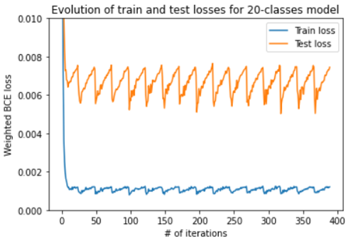
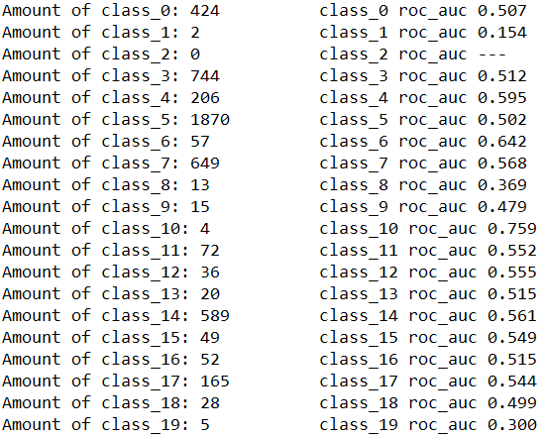
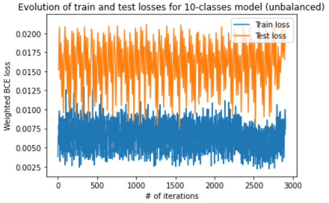
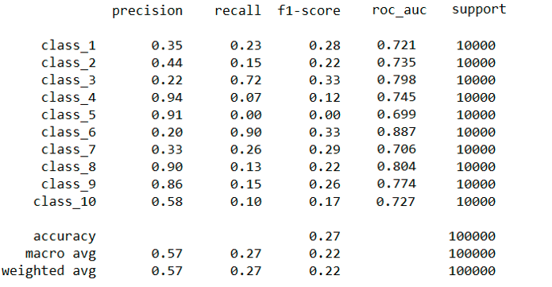
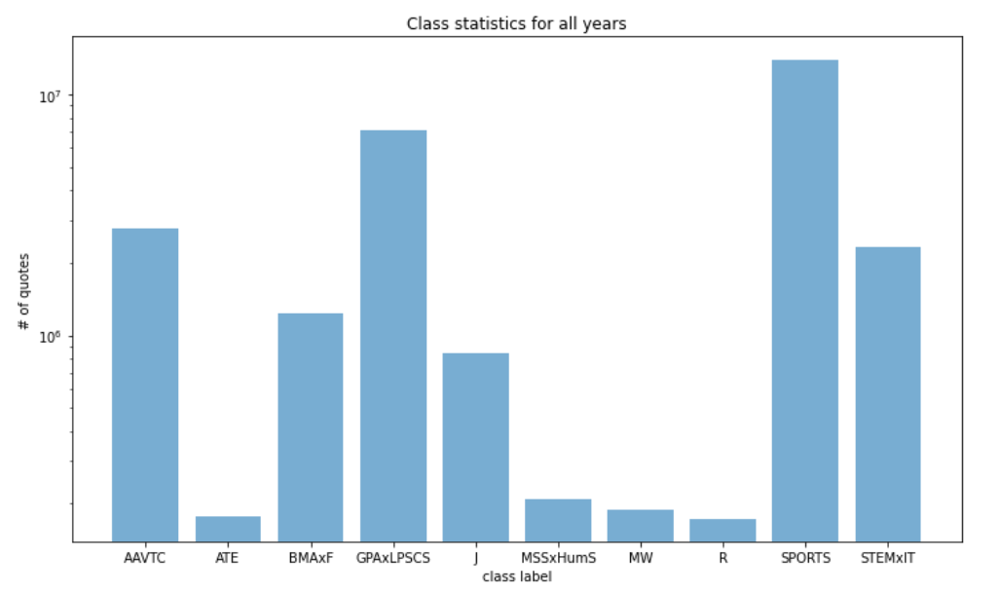
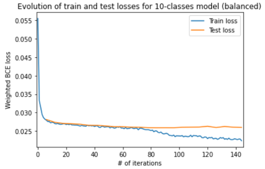
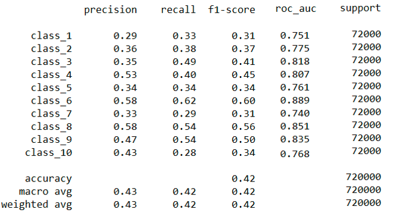
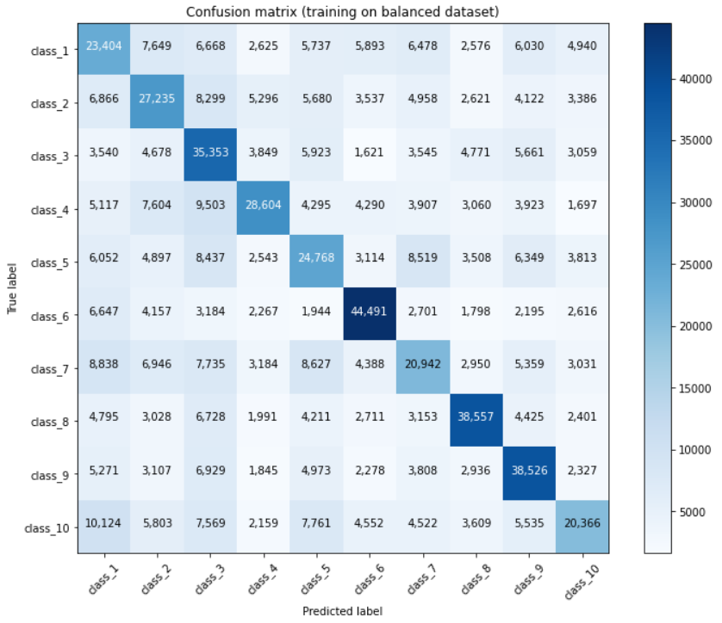
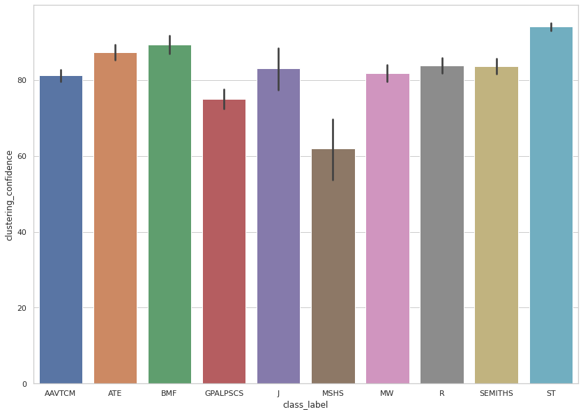

Ever heard of [Catch Me If You Can](https://en.wikipedia.org/wiki/Catch_Me_If_You_Can)? In this movie, the main character impersonates many professions, mainly by adopting their uniforms, specific behaviors, and jargon, and everyone falls for it!

<figure>
    

    
    

</figure>

For the uniform, it's quite obvious, but what about the lingo? While it's true that each occupation has its 'proper words,' let's dig a little deeper. A person in a specific profession not only uses certain terminology but also expresses themselves in a particular way. Think of a politician—not only does he speak about topics like the economy and education, but he also employs certain figures of speech, and his discourse is fluid and well-structured. Now compare that to the way a sportsman or a scientist might communicate, for example.

Based on this, give us a quote, and we’ll tell you which profession said it!

## Table of Contents

- [Datasets](#datasets)
- [Filtering](#filtering)
- [Occupation clustering](#occupation-clustering)
- [BERT](#bert)
- [Results](#results)
- [Room for improvement](#room-for-improvement)
- [Conclusion](#conclusion)
- [References](#references)

## Datasets   

We present the two main datasets used in this project. You can access them via the link in the top menu.

#### Quotebank

What do we have here? The full dataset consists of 178 million quotations, along with a list of possible speakers ranked by probability, the name of the most likely speaker, and their [Wikidata](https://www.wikidata.org/wiki/Wikidata:Main_Page) QID (when available), as well as when and where the quotation was published. The latter is particularly important because this information was extracted from 162 million English news articles published between 2008 and 2020, so one might want to keep a record of it.

162 million, 178 million—but who did all that? Well, it’s thanks to the helpful library assistant, Quobert, and it does it all for free! Here's a helpful image[^1] that explains in full detail how the dataset was collected and might help you better understand Quobert's workflow.

<figure>
    

    
    

</figure>

Super nice, except that it correctly attributes only about 85% of the quotations. But can you really expect better from an unpaid assistant?
Here are some examples of its failures:

<figure>
    

    
    

</figure>

* The Harry Potter he refers to is an [Australian journalist](https://en.wikipedia.org/wiki/Harry_Potter_(journalist)).
* One can doubt that Joe Biden would talk about himself in this way.

But this will be good enough for our purposes. Just keep in mind that Quobert is an unpaid assistant.
Furthermore, for this project, we did not use the entire Quotebank; we only utilized the data from 2015 to 2020.

#### External sources
We mentioned that we want to predict the occupations, but we haven't said much about it so far. Quotebank is augmented using metadata about the speakers. We have an external dataset that provides additional information—such as occupation, gender, religion, etc.—for approximately 9 million Wikidata entities.

## Filtering

First, we had to address the "homonym issue." This arises because each quotation is linked to a list of names ranked by probability, which is then connected to a single name in a "winner-takes-all" fashion. Once a name is selected, it is linked to its corresponding QID. However, if a name has a namesake, multiple QIDs may be associated with it. So, how do we differentiate between Harry Potter the magician and Harry Potter the journalist? (Although this doesn't directly apply in this case since there are no fictional characters in Quotebank, you get the point.) Furthermore, if Quobert is uncertain, it simply assigns "None" as the speaker, resulting in an empty list of QIDs. To address these issues, we filtered out all speakers whose list of QIDs contained either more or less than one QID. By doing so, we tackled both the "homonym issue" and the "empty speaker issue," ultimately eliminating 50% of the remaining data.

<figure>
    

    
    

</figure>

Now, suppose that Harry Potter the magician grew tired of fighting evil, especially since You-Know-Who was defeated in 2011. He decided to start a career as a journalist at the renowned Daily Prophet newspaper. We now have both Harry Potter the magician and Harry Potter the journalist, which are technically the same person. So, how do we determine whether his quotes are those of a magician or those of a journalist?

This is why we remove all speakers who have more than one occupation. By doing so, we eliminate 12% of the remaining data.

## Occupation clustering

By applying our filtering criteria to the external dataset, we find that there are 6,800 different occupations within it. This is quite a lot. Here’s a look at the distribution of occurrences of these occupations:

<figure>
    

    
    

</figure>

We selectected an amount we can sort by hand = 280 (even though it is still a piece of work), this correspond to a treshold of occurencies > 1000. The downside is that we loose a lot of occupation just because we can't sort them by hand. We would need another unpaid assistant to do it for us... and we will come back later to that. Those "unclustered" occupations are gathered in `Other`. There was some "nan" occupation that survived the df.dropna() because they were of type string. We store those in `NoOcc`. The later class won't be use on the next step. It can be seen as a garbage class. 

To define some clusters we looked at those publications [here](https://repository.library.georgetown.edu/handle/10822/559298)[^2] and [there](https://www.leyden212.org/Page/4244) about Career Clusters. After that, we classified by hand our occupations with occurencies > 1000 in similar clusters and assign our quotations to unique occupation. (recall: 1 quotation >> a unique Qid speaker >> a sole occupation). We build two new datasets:  
One consists of 4 classes, it will be used  for the proof-of-concept of the -later explained- BERT-based classifier:

| Cluster | Label | Meaning | # of quote|
|-------|--------|---------|---------|
| 0 | Research | Research and science related careers | 2'372'142 |
| 1 | Politics | Government related careers | 6'928'256 |
| 2 | Sports | Sport related careers | 13'237'461 |
| 3 | Arts | Artists and creator related careers | 2'421'718 |

<figure>
    

    
    

</figure>

The second one consists of the 20 classes:

| Cluster | Label | Meaning | # of quote|
|-------|--------|---------|---------|
| 0 | Other| NaN careers | 2'167'753|
| 1 | AFNR | Agriculture, Food and Natural Resources careers | 9'891 |
| 3 | AAVTC | Arts, Audio/Video Technology and Communications careers | 2'649'277 |
| 4 | BMA | Business Management and Administration careers | 961'273 |
| 5 | ET | Education and Training careers | 14'009'216 |
| 6 | F | Finance careers | 275'615 |
| 7 | GPA | Government and Public Administration careers | 6'491'038 |
| 8 | HS | Health Science careers | 46'010 |
| 9 | HumS | Human Services careers | 111,'82 |
| 10 | IT | Information Technology careers | 14'356 |
| 11 | LPSCS | Law, Public Safety, Corrections, and Security careers | 639'833 |
| 12 | M | Manufacturing careers | 129'037 |
| 13 | MSS | Marketing, Sales, and Service careers | 97'653 |
| 14 | STEM | Science, Technology, Engineering, and Mathematics careers | 2'152'432 |
| 15 | R | Religion related careers | 173'688 |
| 16 | AT | Academic and Teacher related careers | 177'524 |
| 17 | J | Journalism related careers | 839'391 |
| 18 | MW | Military and War related careers | 179'833 |
| 19 | AS | Aircraft and Space careers | 24'947 |
| 20 | NoOcc | Not clustered careers | 1365 |

<figure>
    

    
    

</figure>

If you noticed that the cluster #2 does not exist in the last table it is just because we created a cluster with no quotes in it by mistake... if yu didn't notice it, this is not so important.

## BERT

We used pretrained BERT-Base model (BertTokenizer and BertModel with 768 hidden layers, introduced in this paper). We add one fully connected layer with 10 output dimensions. BertTokenizer transforms input string into tokens, then BertModel returns 768-dimensional representation of input string. Further, added layer produce 10 values which after applying sigmoid function predict the probabilities of each class.

The weighted binary cross entropy was used as a loss function. The weights were used to decrease the effect of unbalanced data. The weights were computed as normalized reverse frequencies of classes in the train data.

For transformer-based models, it is convenient to use a schedular which changes learning rate during training to make training more smooth: smoothness increases the learning rate from zero to set value during warmup training period and smoothly decrease it to zero for last part of training. We used linear schedular with warmup period equals to first 10% of total training steps.

After several training trials we found that weighted loss does not fully prevent overfitting to the most frequent classes. For training the final model, we decided to create fully balanced train and test datasets. 

## Results
We present here the different results: the "proof-of-concept" classification, followed by the 20 classes classification, and an extra step ;)

#### Proof-of-concept
We trained and tested with unbalanced datasets, but make use of weighted loss. Furthermore, to save memory, we decided to crop all quotes up to 300 characters.
After having fed the classifier with the quotes classified following the 4-classes table, and trained it for 20 minutes, we get the following results:

<figure>
    

    
    

</figure>

The behaviour of the curves has nothing to do with the swiss mountains; it just come from the fact that we used a scheduler to vary the lerning rate of our AdamW optimizer. But its initialization was not well set and it initialized repeatidly instead of only once, so we find the strange behaviour. But it is fixed in the last use of the classifier.  
The important point is that it learns well and fast ! Here is the roc_auc for each class:

<figure>
    

    
    

</figure>

"Amount of class*" states the number of quote belonging to this class in the test set. As said before, it is unbalanced.  
The results seems convincing. Next step: just feed the classifier with the quotes classified following the 20-classes table, run it for 8-10h and that's it! 

#### 20 classes
We trained and tested with unbalanced datasets, but make use of weighted loss. After having trained for about 9h, we get the following results:

<figure>
    

    
    

</figure>

(Same problem with scheduler, wait for it). Ok, we can't assess if it is good or bad by looking at the evolution of the loss but what about the roc_auc values ?

<figure>
    

    
    

</figure>

They are close to 0.5, which means that the classifier just classify randomly. This is super bad !

#### Can we do better ?
We assumed that the problem came from the fact that we have to many classes. So we decided to move from 20 to only 10 classes. We merge the classes according their similarity.  Here is the new classification table:

| Cluster | Label | Meaning | # of quote before filtering | # of quote after filtering |
|-------|--------|---------|---------|---------|
| 0 | AAVTCM | Arts, Audio/Video Technology and Communications careers | 2'778'314 | 2'289'052 |
| 1 | BMAxF | Business Management and Administration careers | 1'236'888 | 1'064'036 |
| 2 | GPAxLPSCS | Government, Law, Security careers | 7'072'268 | 6'159'748 |
| 3 | MSSxHumS | Marketing, Sales and Service careers | 209'135 | 180'941 |
| 4 | ATE | Academic and Teacher related careers | 177'524 | 152'000 |
| 5 | SPORTS | Sport careers | 14'009'216 | 11'593'709 |
| 6 | STEMxIT | Science, Technology, Mathematics and Health science careers | 2'316'481 | 2'005'419 |
| 7 | R | Religion related careers | 173'688 | 159'630 |
| 8 | J | Journalism related careers | 839'391 | 143'374 |
| 9 | MW | Military and War related careers | 188'863 | 678'870 |

Furthermore, after some reflexions, it seemed that the unbalanced testing set was fooling us in some ways for the interpretation of the results. Thus, this step is done with unbalaced training set but balanced testing set.  Finally, we made the assumption that quotes with # of characters < 50 were not containing relevant information and we filtered them out. This allowed us to save some space and we augmented the "crop treshold" from 300 to 400.

<figure>
    

    
    

</figure>

Well, even though the scheduler thing is still not fixed (waaiiiiiit for iiiit), those loss curves are kind of impossible to interpret in any ways. We can look at extended performance metrics:

<figure>
    

    
    

</figure>

Here, "support" states that there is 10'000 quotes/class in the test set.  
We can see that the f1 score is low for some classes. We then decided to plot the confusion matrix of classification. And here is what we got:

<figure>
    

    
    

</figure>

Even though the diagonal term seems to by the higher column-wise, some columns behaves as attractors. That is the classes 3,6 (GPAxLPSCS, SPORTS) and 1,2,7 (AAVTCM, BMAxF, STEMxIT). Unsurprisingly, this is correlated with the number of quote per class in the training set. The weighted loss does not correct the problem ! We have to try to pass it a balanced training set 

<figure>
    

    
    

</figure>

#### Putting the pieces together
As said before, we decided as final step to balance the training set. The bottleneck class is `Journalism` with 143'374 quotes. We build a final training set containing 72'000 quotes of each class and a test set containg 72'000 quotes of each class as well.  
Good news, we fixed the scheduler as well. Here is our loss curves :

<figure>
    

    
    

</figure>

It finally behaves normally. What about the performance metrics ?

<figure>
    

    
    

</figure>

Seems good as well. And for the confusion matrix ? 

<figure>
    

    
    

</figure>

Great ! Problem fixed :)

## Room for improvement

We finally got a unpaid assistant working for the occupation classification. We did not have time to use it in the classification process. 

#### Sentence-BERT algorithm for occupation clustering

[Sentence-BERT](https://joeddav.github.io/blog/2020/05/29/ZSL.html) is a recent technique which fine-tunes the pooled BERT sequence representations for increased semantic richness, as a method for obtaining sequence and label embeddings.

This pretrained algorithm not only made occupation clustering automatically, but also clustered all the 6800 unique occupations !

Sentence-BERT was used to cluster 6800 occupations into 10 defined clusters, by stating for each occupation 10 hypotheses and taking clustering each to the maximum prediction confidence of this algorithm. The plot below shows the distribution of the prediction confidence for each cluster over the filtered additional dataset.

<figure>
    

    
    

</figure>

## Conclusion
We finally get a classifier performing correctly. Furthermore, it would awesome to make use of the implemented automated occupation clusterer. But this is your job if you want to ;)  

Thank for having read us! I hope you enjoyed your ADAventure with us.

The k-dim team.

## References 

[^1]: [Vaucher, T., Spitz, A., Catasta, M., & West, R. (2021, March). Quotebank: A Corpus of Quotations from a Decade of News. In Proceedings of the 14th ACM International Conference on Web Search and Data Mining (pp. 328-336).](https://dlab.epfl.ch/people/west/pub/Vaucher-Spitz-Catasta-West_WSDM-21.pdf)
[^2]: [Carnevale, A. P., Smith, N., Stone III, J. R., Kotamraju, P., Steuernagel, B., & Green, K. A. (2013). Career clusters: Forecasting demand for high school through college jobs, 2008-2018.](https://repository.library.georgetown.edu/handle/10822/559298)

<b>Images</b>

<ul>
    
<li>2017-11-11-170105.jpg. (2021, December 16). https://wallpapercave.com/w/wp3396925</li>
<li>tenor.gif. (2021, December 16). https://media1.tenor.com/images/24eba459fc0a6e19c4d2d60ed678e2f9/tenor.gif?itemid=7219821</li>
<li>[Quobert.PNG (2021, December 17). https://dlab.epfl.ch/people/west/pub/Vaucher-Spitz-Catasta-West_WSDM-21.pdf<\li>
<li>tumblr_l982reZrDD1qzcmp3o1_500.gif (2021, December 17). http://1.bp.blogspot.com/-kQcj14MDfdA/Tl7fyQQ_hnI/AAAAAAAAAE8/KI-pUSWaHF8/s1600/tumblr_l982reZrDD1qzcmp3o1_500.gif <\li>
    
 </ul>
 

