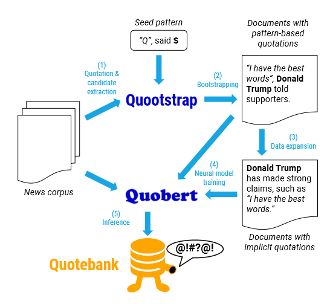
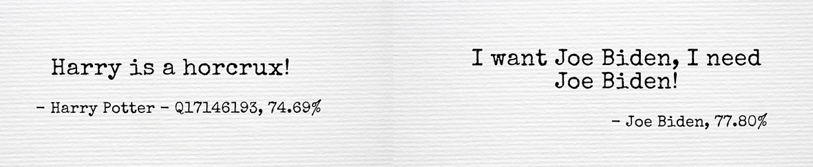
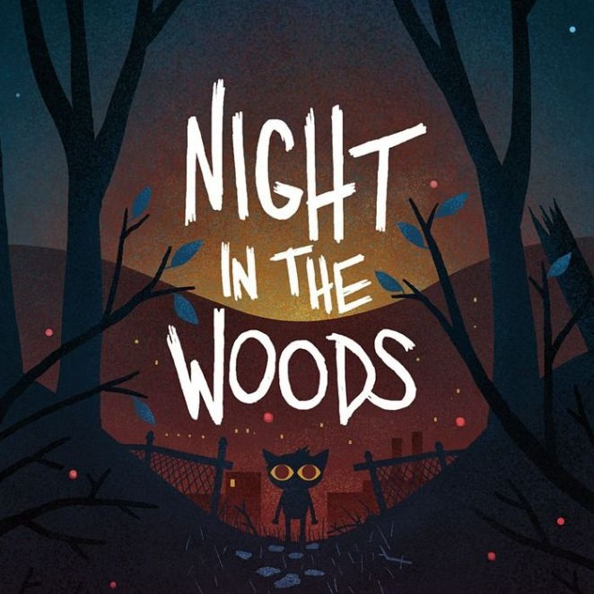
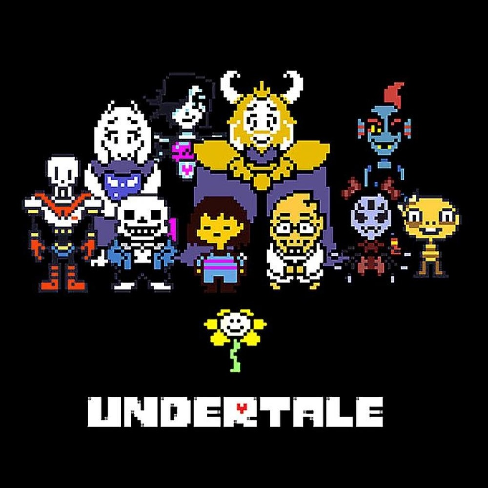
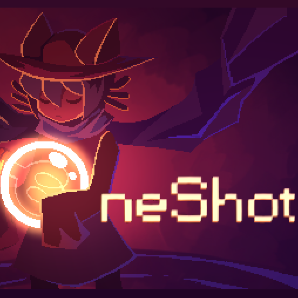
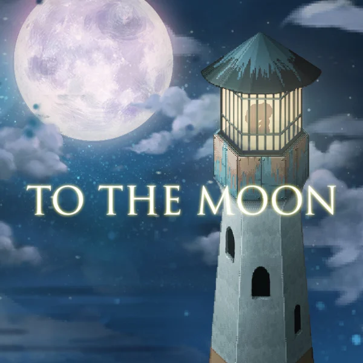
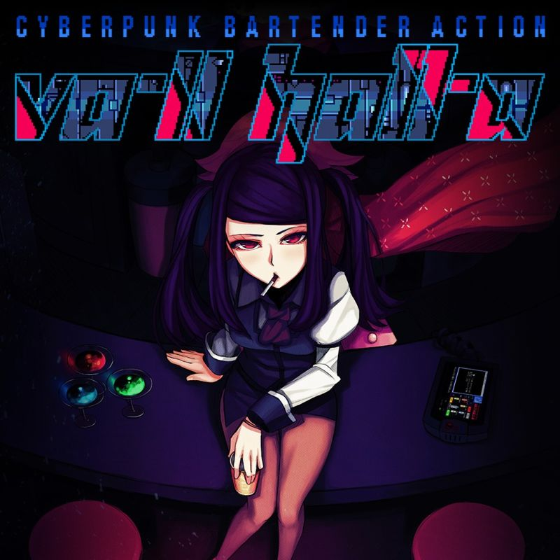
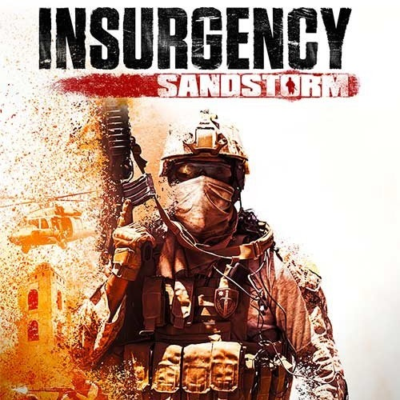
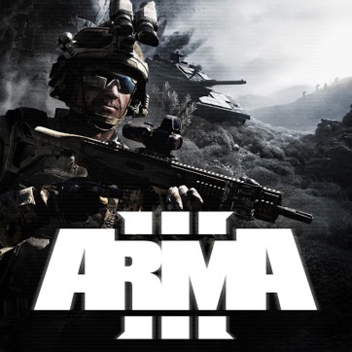

Ever heard of [Catch Me If You Can](https://en.wikipedia.org/wiki/Catch_Me_If_You_Can) ? In this movie, the main character impersonates many professions mainly by appropriating their uniforms, specific behaviours and lingos, and everybody fall for it !  

<figure>
    

    
    

</figure>

For the uniform it is quite obvious, but what can we say about the lingo ? One will agree that each occupation has its « proper words », but let's think further, a person of a specific profession will also express himself in a certain manner. Think of a politician, he does not only speaks about economy and education, but also uses some figure of speech, and his discourse is fluid and well conducted; rather of a sportsman or a scientist, for exemple.  

Based on this statement: give us a quote, and we will tell you which profession said it ! 

## Table of Contents

- [Dataset](#dataset)
- [Preprocessing](#preprocessing)
- [Occupation clustering](#occupation-clustering)
- [BERT](#bert)
- [First results](#first-results)
- [Can we do better ?](#can-we-do-better)
- [Results and limitations](#results-and-limitations)
- [Room for improvement](#room-for-improvement)
- [References](#references)

## Datasets  

#### Quotebank
We do we have here ? The full dataset is made of 178 million quotations together with a list of possible speaker ranked by probability, the name of the most probable speaker and its [Wikidata](https://www.wikidata.org/wiki/Wikidata:Main_Page) qid, when it has been published, and where it has been published. The later is important because this information has been exctracted out of 162 million English news articles published between 2008 and 2020 included, so one might want to keep records of it.

162 million, 178 million, but who did that ? Well it's the nice library assistant Quobert, and it does it freely. Here is a nice picture (taken from the paper[^3] explaining in full detail how the dataset has been collected) that could help you to grasp Quobert's workflow.

<figure>
    

    
    

</figure>

Super nice, except that it correctly attributes only about 85% of the quotations. But could you except better from un unpaid assistant ?  
Here is some of its failures:

<figure>
    

    
    

</figure>

* The Harry Potter he refers to is an [Australian journalist](https://en.wikipedia.org/wiki/Harry_Potter_(journalist)).
* Joe Bidden does not like himself so much.

But this will be good enough for our purpose. Just keep in mind that Quobert is an unpaid assistant.  
Furthermore, for this project, we did not use the full Quotebank but only the years 2015-2020 included.

#### External sources
We said we want to predict the occupations but did not said a word about it so far... Quotebank is augmented using metadata about the speakers. It an external dataset we will find for ~9M Wikidata entities some additional information as occupation, gender, religion, etc.

## Preprocessing
wewewewe

## Occupation clustering
blalala

## BERT
blalala

## First results
blalala

## Can we do better ?
blalala

## Results and limitations 
blalala

## Room for improvement
blalala

For this project, we used a large-scale dataset of Steam reviews compiled in 2021, which is openly available on Kaggle[^1].

#### Contents

#### Source caveats

#### Game tags

## Game embeddings

 train a Sent2vec[^2] 

[**this dedicated page**]()

## Classification with K-means clustering

<b>Click to view clusters</b> (games ordered alphabetically)

 
<ul>

<li><b>Cluster 1:</b> Banished, Factorio, Frostpunk, Kenshi, No Man's Sky, Oxygen Not Included, RimWorld, Satisfactory, Subnautica, Super Hexagon, Surviving Mars</li>

<li><b>Cluster 2:</b> Assassin's Creed Odyssey, Assassin's Creed Origins, Batman: Arkham Asylum GOTY Edition, BioShock Infinite, Dishonored, Dying Light, Rise of the Tomb Raider, Tomb Raider</li>

</ul>
 

The figure below shows the games which are part of each cluster. Use the menu to navigate to the cluster of your choice.
<iframe frameborder="no" border="0" marginwidth="0" marginheight="0" width="100%" height="500" src="/html/clusters.html"></iframe>
If you know your games well, you'll see that the clustering worked quite well, aside from a few oddities.

| Cluster | Size | Steam Genres | User-defined Tags | Prototype |
|-------|--------|---------|---------|---------|
| 1 | 11 | - | User Singleplayer | _Oxygen Not Included_ |
| 2 | 8 | Action | Action, Story Rich | _Rise of the Tomb Raider_ |
| 3 | 19 | - | Multiplayer, Singleplayer, Strategy | _Total War Saga: Thrones of Britannia_ |
| 4 | 8 | - | Adventure, Great Soundtrack, Singleplayer | _GRIS_ |
| 5 | 18 | Action | Action, Multiplayer | _SCUM_ |
| 6 | 11 | - | - | _Slay the Spire_ |
| 7 | 11 | - | Co-op, Multiplayer | _BattleBlock Theater_ |
| 8 | 16 | - | - | _Danganronpa: Trigger Happy Havoc_ |
| 9 | 10 | Action | Action, Co-op, Shooter, Singleplayer | _Tom Clancy's Ghost Recon® Wildlands_ |
| 10 | 6 | RPG | Adventure, Great Soundtrack, RPG, Singleplayer, Story Rich | _Tales of Berseria_ |
| 11 | 11 | Action | Action, Singleplayer | _Resident Evil 2_ |
| 12 | 10 | - | Action | _Ravenfield_ |
| 13 | 11 | RPG | RPG | _Pillars of Eternity II: Deadfire_ |
| 14 | 7 | - | Great Soundtrack, Singleplayer | _PAYDAY 2_ |
| 15 | 5 | - | Singleplayer | _Euro Truck Simulator 2_ |
| 16 | 6 | Action | Action, Adventure, Difficult, Great Soundtrack | _Nioh: Complete Edition_ |
| 17 | 8 | Indie | Indie, Open World, Sandbox, Singleplayer | _Don't Starve_ |
| 18 | 9 | - | Indie, Singleplayer | _Super Meat Boy_ |
| 19 | 10 | Simulation | - | _Farming Simulator 19_ |
| 20 | 5 | - | Puzzle | _The Room_ |

## A closer look at the reviews  
#### Comparing four close games: _Night in the Woods_, _Undertale_, _OneShot_, and _To the Moon_

Four games appear close together in our embeddings: _Night in the Woods_, _Undertale_, _OneShot_, and _To the Moon_, with all of their distance to one another contained between 0.161 and 0.230. Although _To the Moon_ is in cluster 4 and the others in cluster 8, they all have the other games as their top 3 (4 in the case of _Night in the Woods_) closest games. Consequently, they will still be considered as an ‘alternate’ smaller cluster for this analysis.

    

        

            
        

        

            

                <h2> Night in the Woods </h2>  
                Night in the Woods is a single-player adventure game. It is a story-focused exploration game in which we play Mae, a character coming back to her hometown that she explores, meeting and interacting with non-playable characters.
            

        

    

 

    

        

            

                <h2> Undertale </h2>  
                In Undertale, we play a human who fell in a hole and ends up exploring an unknown world, encountering villagers and ‘enemies’ we can choose to fight or spare, with our main aim being to come back to the surface and in our own world.
            

        

        

            
        

    

 

    

        

            
        

        

            

                <h2> Oneshot </h2>  
                OneShot is a story in which we control a child from an outside perspective, acting as a sort of guardian for them. The game also has an interactive part with the operating system, which is praised in the reviews for its originality.
            

        

    

 

    

        

            

                <h2> To the Moon </h2>  
                To the Moon is a puzzle and adventure game. You play as two doctors exploring an old man’s memories to alter them, so that he can die with his dying wish completed in his memories.
            

        

        

            
        

    

Looking at the content of these games' reviews to try and find what patterns may have been found by our embedding method, several elements are striking. The four games' reviews have frequent references to terms referring to:
- the story in a highly positive way, commenting on the quality of the writing
- emotions, with words such as 'feelings', 'cry', 'sad', 'happy'
- comments on the games not being focused on gameplay
- remarks on the high quality of the soundtrack
- the word 'experience'

The four of them have 'Story rich' and 'Great Soundtrack' in their top 3 user-defined tags. This is unsurprising: users reviewing the games and assigning them tags are most probably broadly the same people. Reading these four games' reviews, then, there seems to be lexical patterns justifying the measurements made by the program.

#### Anomaly? _Night in the Woods_ and _VA-11 Hall-A: Cyberpunk Bartender Action_

_Night in the Woods_ is the only game of this cluster having a closer neighbour than the three others in this group: _VA-11 Hall-A: Cyberpunk Bartender Action_. It is a game in which the player incarnates a bartender preparing and serving drinks to different customers while listening to them in a cyberpunk setting.

    

        

            
        

        

            

                <h2> VA-11 Hall-A: Cyberpunk Bartender Action </h2>  
                In this game you play a bartender at the eponymous VA-11 HALL-A, a small bar in a dystopian downtown which is said to attract the "most fascinating" of people. Gameplay consists of players making and serving drinks to bar attendees whilst listening to their stories and experiences.
            

        

    

    

        

            

                <h2> Insurgency: Sandstorm </h2>  
                Insurgency: Sandstorm is a multiplayer tactical first-person shooter. It is set in an unnamed fictional Middle <a href="https://en.wikipedia.org/wiki/Konami_Code" target="_blank">Easter</a>n region, the game depicts a conflict between two factions: "Security" and "Insurgents".
            

        

        

            
        

    

 

    

        

            
        

        

            

                <h2> Arma 3 </h2>  
                ARMA 3 is an open-world, realism-based, military tactical shooter video game. The single-player campaign has the player take control of U.S. Army soldier Corporal Ben Kerry. In the single player mode, the player is placed in a variety of situations, from lone wolf infiltration missions to the commanding of large-scale armored operations. This game has a very active modding community.
            

        

    

## References 

[^1]: [Kaggle, *Steam Reviews Dataset 2021*, 2021](https://www.kaggle.com/najzeko/steam-reviews-2021)
[^2]: [Matteo Pagliardini, Prakhar Gupta, Martin Jaggi, *Unsupervised Learning of Sentence Embeddings using Compositional n-Gram Features*, NAACL 2018](https://github.com/epfml/sent2vec)
[^3]: [Vaucher, T., Spitz, A., Catasta, M., & West, R. (2021, March). Quotebank: A Corpus of Quotations from a Decade of News. In Proceedings of the 14th ACM International Conference on Web Search and Data Mining (pp. 328-336).](https://dlab.epfl.ch/people/west/pub/Vaucher-Spitz-Catasta-West_WSDM-21.pdf)

<b>Images</b>

<ul>
    
<li>2017-11-11-170105.jpg. (2021, December 16). https://wallpapercave.com/w/wp3396925</li>
<li>tenor.gif. (2021, December 16). https://media1.tenor.com/images/24eba459fc0a6e19c4d2d60ed678e2f9/tenor.gif?itemid=7219821</li>
<li>[Quobert.PNG (2021, December 17)](https://dlab.epfl.ch/people/west/pub/Vaucher-Spitz-Catasta-West_WSDM-21.pdf)<\li>
    
 </ul>
 

