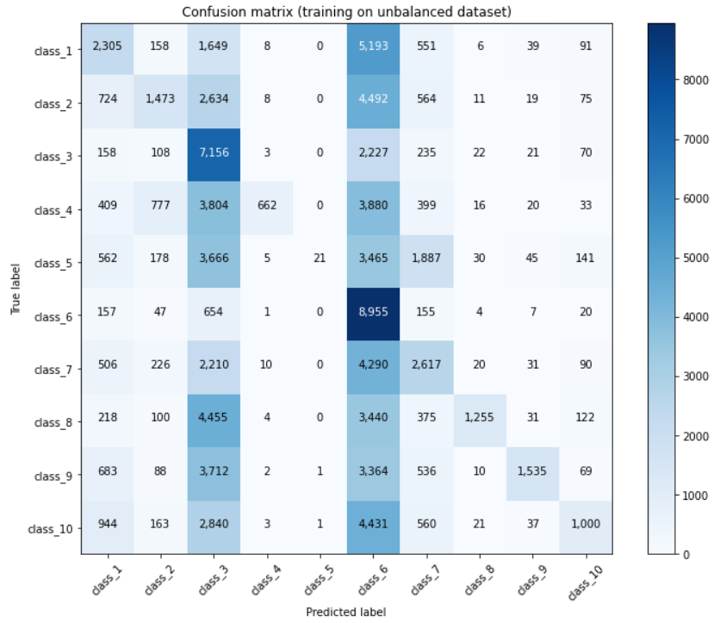

Ever heard of [Catch Me If You Can](https://en.wikipedia.org/wiki/Catch_Me_If_You_Can)? In this movie, the main character impersonates many professions, mainly by adopting their uniforms, specific behaviors, and jargon, and everyone falls for it!

<figure>
    

    
    

</figure>

For the uniform, it's quite obvious, but what about the lingo? While it's true that each occupation has its 'proper words,' let's dig a little deeper. A person in a specific profession not only uses certain terminology but also expresses themselves in a particular way. Think of a politician—not only does he speak about topics like the economy and education, but he also employs certain figures of speech, and his discourse is fluid and well-structured. Now compare that to the way a sportsman or a scientist might communicate, for example.

Based on this, give us a quote, and we’ll tell you which profession said it!

## Table of Contents

- [Datasets](#datasets)
- [Filtering](#filtering)
- [Occupation clustering](#occupation-clustering)
- [BERT](#bert)
- [Results](#results)
- [Conclusion](#conclusion)
- [Room for improvement](#room-for-improvement)
- [References](#references)

## Datasets   

We present the two main datasets used in this project. You can access them via the link in the top menu.

#### Quotebank

What do we have here? The full dataset consists of 178 million quotations, along with a list of possible speakers ranked by probability, the name of the most likely speaker, and their [Wikidata](https://www.wikidata.org/wiki/Wikidata:Main_Page) QID (when available), as well as when and where the quotation was published. The latter is particularly important because this information was extracted from 162 million English news articles published between 2008 and 2020, so one might want to keep a record of it.

162 million, 178 million—but who did all that? Well, it’s thanks to the helpful library assistant, Quobert, and it does it all for free! Here's a helpful image[^1] that explains in full detail how the dataset was collected and might help you better understand Quobert's workflow.

<figure>
    

    
    

</figure>

Super nice, except that it correctly attributes only about 85% of the quotations. But can you really expect better from an unpaid assistant?
Here are some examples of its failures:

<figure>
    

    
    

</figure>

* The Harry Potter he refers to is an [Australian journalist](https://en.wikipedia.org/wiki/Harry_Potter_(journalist)).
* One can doubt that Joe Biden would talk about himself in this way.

But this will be good enough for our purposes. Just keep in mind that Quobert is an unpaid assistant.
Furthermore, for this project, we did not use the entire Quotebank; we only utilized the data from 2015 to 2020.

#### External sources
We mentioned that we want to predict the occupations, but we haven't said much about it so far. Quotebank is augmented using metadata about the speakers. We have an external dataset that provides additional information—such as occupation, gender, religion, etc.—for approximately 9 million Wikidata entities.

## Filtering

First, we had to address the "homonym issue." This arises because each quotation is linked to a list of names ranked by probability, which is then connected to a single name in a "winner-takes-all" fashion. Once a name is selected, it is linked to its corresponding QID. However, if a name has a namesake, multiple QIDs may be associated with it. So, how do we differentiate between Harry Potter the magician and Harry Potter the journalist? (Although this doesn't directly apply in this case since there are no fictional characters in Quotebank, you get the point.) Furthermore, if Quobert is uncertain, it simply assigns "None" as the speaker, resulting in an empty list of QIDs. To address these issues, we filtered out all speakers whose list of QIDs contained either more or less than one QID. By doing so, we tackled both the "homonym issue" and the "empty speaker issue," ultimately eliminating 50% of the remaining data.

<figure>
    

    
    

</figure>

Now, suppose that Harry Potter the magician grew tired of fighting evil, especially since You-Know-Who was defeated in 2011. He decided to start a career as a journalist at the renowned Daily Prophet newspaper. We now have both Harry Potter the magician and Harry Potter the journalist, which are technically the same person. So, how do we determine whether his quotes are those of a magician or those of a journalist?

This is why we remove all speakers who have more than one occupation. By doing so, we eliminate 12% of the remaining data.

## Occupation clustering

By applying our filtering criteria to the external dataset, we find that there are 6,800 different occupations within it. This is quite a lot. Here’s a look at the distribution of occurrences of these occupations:

<figure>
    

    
    

</figure>

We selected a manageable number of occupations to sort by hand: 280 (though it's still quite a bit of work). This corresponds to a threshold of occurrences greater than 1,000. The downside is that we lose many occupations simply because we can't sort them manually. We would need another unpaid assistant to help with that, but this resource became available in a later step of the project, as discussed in [this section](#room-for-improvement). The "unclustered" occupations are grouped under `Other`. There were some "NaN" occupations that survived the `df.dropna()` method because they were of type string. We store those in `NoOcc`. The latter class won't be used in the next step and can be considered a garbage class.

To define some clusters, we examined the publications [here](https://repository.library.georgetown.edu/handle/10822/559298)[^2] and [there](https://www.leyden212.org/Page/4244) regarding Career Clusters. After that, we manually classified our occupations with occurrences greater than 1,000 into similar clusters and assigned our quotations to a unique occupation. (Recall: 1 quotation >> 1 unique QID speaker >> 1 sole occupation.) We built two new datasets:

One consists of 4 classes and will be used for the proof of concept of the BERT-based classifier, which will be explained later.

| Cluster | Label | Meaning | # of quote|
|-------|--------|---------|---------|
| 0 | Research | Research and science related careers | 2'372'142 |
| 1 | Politics | Government related careers | 6'928'256 |
| 2 | Sports | Sport related careers | 13'237'461 |
| 3 | Arts | Artists and creator related careers | 2'421'718 |

<figure>
    

    
    

</figure>

The second dataset consists of 20 classes:

| Cluster | Label | Meaning | # of quote|
|-------|--------|---------|---------|
| 0 | Other| NaN careers | 2'167'753|
| 1 | AFNR | Agriculture, Food and Natural Resources careers | 9'891 |
| 3 | AAVTC | Arts, Audio/Video Technology and Communications careers | 2'649'277 |
| 4 | BMA | Business Management and Administration careers | 961'273 |
| 5 | ET | Education and Training careers | 14'009'216 |
| 6 | F | Finance careers | 275'615 |
| 7 | GPA | Government and Public Administration careers | 6'491'038 |
| 8 | HS | Health Science careers | 46'010 |
| 9 | HumS | Human Services careers | 111,'82 |
| 10 | IT | Information Technology careers | 14'356 |
| 11 | LPSCS | Law, Public Safety, Corrections, and Security careers | 639'833 |
| 12 | M | Manufacturing careers | 129'037 |
| 13 | MSS | Marketing, Sales, and Service careers | 97'653 |
| 14 | STEM | Science, Technology, Engineering, and Mathematics careers | 2'152'432 |
| 15 | R | Religion related careers | 173'688 |
| 16 | AT | Academic and Teacher related careers | 177'524 |
| 17 | J | Journalism related careers | 839'391 |
| 18 | MW | Military and War related careers | 179'833 |
| 19 | AS | Aircraft and Space careers | 24'947 |
| 20 | NoOcc | Not clustered careers | 1365 |

<figure>
    

    
    

</figure>

If you noticed that cluster #2 does not exist in the last table, it is simply because we mistakenly created a cluster with no quotes in it. If you didn’t notice it, then it’s not particularly important.

## BERT

We used the pretrained BERT-Base model. We added one fully connected layer with 10 output dimensions. The BertTokenizer transforms the input string into tokens, and then the BertModel returns a 768-dimensional representation of the input string. The additional layer produces 10 values, which, after applying the sigmoid function, predict the probabilities of each class.

We utilized weighted binary cross-entropy as the loss function. The weights were applied to mitigate the impact of unbalanced data, computed as normalized reverse frequencies of the classes in the training data.

For transformer-based models, it is convenient to use a scheduler that adjusts the learning rate during training to create a smoother learning process. This approach gradually increases the learning rate from zero to a set value during the warm-up period and then smoothly decreases it to zero during the final stages of training. We used a linear scheduler with a warm-up period equal to the first 10% of the total training steps.

After several training trials, we found that the weighted loss did not fully prevent overfitting to the most frequent classes. Therefore, for training the final model, we decided to create fully balanced training and test datasets.

## Results
We present the different results here: first, the 'proof-of-concept' classification, followed by the 20-class classification, and then an extra step. ;)

#### Proof-of-concept
We trained and tested using unbalanced datasets but employed weighted loss. Additionally, to save memory, we decided to crop all quotes to a maximum of 300 characters.

After feeding the classifier with the quotes classified according to the 4-class table and training it for 20 minutes, we obtained the following results:

<figure>
    

    
    

</figure>

The behavior of the curves stems from the fact that we used a scheduler to vary the learning rate of our AdamW optimizer. However, the initialization was not set correctly, leading to repeated initialization instead of just once, which caused the strange behavior. This issue has been fixed in the latest use of the classifier.

The important point is that it learns well and quickly! Here is the ROC AUC for each class:

<figure>
    

    
    

</figure>

`Amount of class` indicates the number of quotes belonging to this class in the test set. As mentioned earlier, the dataset is unbalanced.
The results seem convincing. The next step is to feed the classifier with the quotes classified according to the 20-class table, run it for 8 to 10 hours, and that’s it!"

#### 20 classes
We trained and tested using unbalanced datasets but employed weighted loss. After training for approximately 9 hours, we obtained the following results:

<figure>
    

    
    

</figure>

While we can’t assess whether the results are good or bad by looking at the evolution of the loss, what about the ROC AUC values?

<figure>
    

    
    

</figure>

They are close to 0.5, which indicates that the classifier is essentially classifying randomly. This is very disappointing!

#### Can we do better ?

We assumed that the problem arose from having too many classes, so we decided to reduce the number from 20 to just 10. We merged the classes based on their similarity. Here is the new classification table:

| Cluster | Label | Meaning | # of quote before filtering | # of quote after filtering |
|-------|--------|---------|---------|---------|
| 0 | AAVTCM | Arts, Audio/Video Technology and Communications careers | 2'778'314 | 2'289'052 |
| 1 | BMAxF | Business Management and Administration careers | 1'236'888 | 1'064'036 |
| 2 | GPAxLPSCS | Government, Law, Security careers | 7'072'268 | 6'159'748 |
| 3 | MSSxHumS | Marketing, Sales and Service careers | 209'135 | 180'941 |
| 4 | ATE | Academic and Teacher related careers | 177'524 | 152'000 |
| 5 | SPORTS | Sport careers | 14'009'216 | 11'593'709 |
| 6 | STEMxIT | Science, Technology, Mathematics and Health science careers | 2'316'481 | 2'005'419 |
| 7 | R | Religion related careers | 173'688 | 159'630 |
| 8 | J | Journalism related careers | 839'391 | 143'374 |
| 9 | MW | Military and War related careers | 188'863 | 678'870 |

Furthermore, after some reflection, it appeared that the unbalanced testing set was misleading us in terms of interpreting the results. Therefore, this step was conducted with an unbalanced training set but a balanced testing set. Finally, we assumed that quotes with fewer than 50 characters did not contain relevant information and filtered them out. This allowed us to save space, and we increased the crop threshold from 300 to 400 characters.

<figure>
    

    
    

</figure>

Well, even though the scheduler issue is still not fixed, those loss curves are quite difficult to interpret. Instead, we can examine extended performance metrics:

<figure>
    

    
    

</figure>

Here, 'support' indicates that there are 10,000 quotes per class in the test set.

We can see that the F1 score is low for some classes. Therefore, we decided to plot the confusion matrix for the classification, and here is what we obtained:"

<figure>
    

    
    

</figure>

Even though the diagonal terms appear to be the highest in each column, some columns behave as attractors. Specifically, classes 3 and 6 (GPAxLPSCS and SPORTS) and classes 1, 2, and 7 (AAVTCM, BMAxF, and STEMxIT) show this behavior. Unsurprisingly, this is correlated with the number of quotes per class in the training set. The weighted loss does not resolve the issue! We need to try using a balanced training set.

<figure>
    

    
    

</figure>

#### Putting the pieces together
As mentioned earlier, we decided to balance the training set as a final step. The bottleneck class is `Journalism`, with 143,374 quotes. We built a final training set containing 72,000 quotes from each class, as well as a test set with 72,000 quotes from each class.

The good news is that we also fixed the scheduler! Here are our loss curves:
<figure>
    

    
    

</figure>

It finally behaves normally. What about the performance metrics?

<figure>
    

    
    

</figure>

Seems good as well. And for the confusion matrix ? 

<figure>
    

    
    

</figure>

Great ! Problem fixed :)

## Conclusion

In this project, we explored the challenges of classifying quotes into various occupational categories using a BERT-based classifier. Through several iterations and adjustments, including balancing our training and testing datasets and refining our approach to class imbalance, we ultimately improved the model's performance metrics.

While the initial results with unbalanced data were discouraging, the adjustments we made—such as filtering out less informative quotes and ensuring a balanced training set—enabled us to achieve more reliable classifications. The final performance metrics indicate a significant improvement, highlighting the importance of dataset preparation and model tuning in machine learning projects.

Moving forward, we aim to further enhance our classifier by exploring additional features and potentially leveraging larger datasets. This journey illustrates the iterative nature of machine learning, where each step brings valuable insights and opportunities for growth.

Thank you for following along, and we look forward to sharing our future findings!

The k-dim team.

## Room for improvement

We finally managed to have an unpaid assistant working on the occupation classification. Unfortunately, we did not have time to integrate it into the classification process. Moving forward, we aim to incorporate this resource to enhance our model's performance and achieve even more accurate results.

#### Sentence-BERT algorithm for occupation clustering

[Sentence-BERT](https://joeddav.github.io/blog/2020/05/29/ZSL.html) is a recent technique that fine-tunes pooled BERT sequence representations to enhance semantic richness, providing a method for obtaining both sequence and label embeddings.

This pretrained algorithm not only facilitated automatic occupation clustering but also managed to cluster all 6,800 unique occupations!

Using Sentence-BERT, we clustered the 6,800 occupations into 10 defined clusters. For each occupation, we generated 10 hypotheses and assigned each to the cluster with the maximum prediction confidence from the algorithm. The plot below illustrates the distribution of prediction confidence for each cluster over the filtered additional dataset.

<figure>
    

    
    

</figure>

## References 

[^1]: [Vaucher, T., Spitz, A., Catasta, M., & West, R. (2021, March). Quotebank: A Corpus of Quotations from a Decade of News. In Proceedings of the 14th ACM International Conference on Web Search and Data Mining (pp. 328-336).](https://dlab.epfl.ch/people/west/pub/Vaucher-Spitz-Catasta-West_WSDM-21.pdf)
[^2]: [Carnevale, A. P., Smith, N., Stone III, J. R., Kotamraju, P., Steuernagel, B., & Green, K. A. (2013). Career clusters: Forecasting demand for high school through college jobs, 2008-2018.](https://repository.library.georgetown.edu/handle/10822/559298)

<b>Images</b>

<ul>
    
<li>2017-11-11-170105.jpg. (2021, December 16). https://wallpapercave.com/w/wp3396925</li>
<li>tenor.gif. (2021, December 16). https://media1.tenor.com/images/24eba459fc0a6e19c4d2d60ed678e2f9/tenor.gif?itemid=7219821</li>
<li>[Quobert.PNG (2021, December 17). https://dlab.epfl.ch/people/west/pub/Vaucher-Spitz-Catasta-West_WSDM-21.pdf<\li>
<li>tumblr_l982reZrDD1qzcmp3o1_500.gif (2021, December 17). http://1.bp.blogspot.com/-kQcj14MDfdA/Tl7fyQQ_hnI/AAAAAAAAAE8/KI-pUSWaHF8/s1600/tumblr_l982reZrDD1qzcmp3o1_500.gif <\li>
    
 </ul>
 

